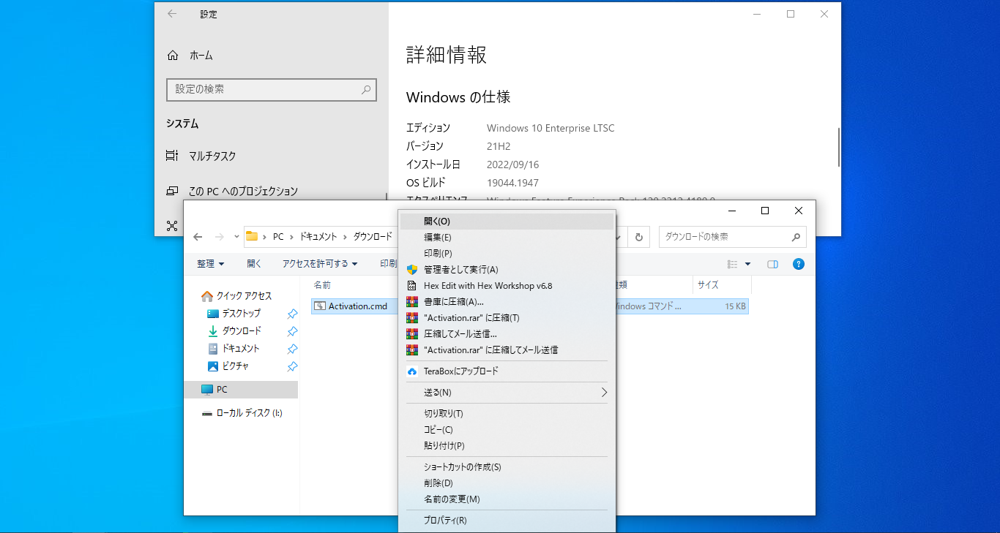

Current v-1.0

日前在國外科技論壇有大神釋出名為HWIDGEN數字啟用工具，該啟用工具幾乎秒殺所有版本Windows 10系統。
我們知道Windows 10現在啟用後會帶有數字權利，數字權利可以在我們重灌系統後自動啟用無需再次執行啟用。
而HWIDGEN啟用工具正是直接獲取數字啟用權利進行永久性啟用，這種方法啟用後使用者下次安裝同樣無需啟用。

使用過程非常簡單 ,大家按照截圖說明操作即可, 理論上只要滿足啟用條件均可成功執行啟用

> 數字權利獲取起使用教程：

啟用條件1：系統最好是微軟原版系統且必須開啟Windows Update服務 , 如果沒有開啟該服務會導致啟用失敗。

啟用條件2：如果你從第三方下載的精簡版或者修改的系統 ,  可能更新服務被禁用無法啟用，建議安裝原本系統。

啟用條件3：電腦必須已經正常連網才可使用此工具執行啟用獲取數字權利 ,  如無法聯網則無法使用本工具啟用。

> HWIDGEN獲得數字權利的啟用原理：

說到啟用原理自然先得繼續介紹Windows 10系統的數字啟用權利，所謂數字權利即與已係統繫結的啟用許可證。
預設情況下當Windows 10被啟用後會自動生成與硬體編號對應的許可證，該許可證會儲存到微軟公司伺服器上。
當系統重新安裝時自動將硬體編號提交給微軟檢索對應的許可證，若許可證符合則系統自動啟用無需使用者再操作。
至於HWIDGEN是如何通過修改系統核心資料來啟用系統就是技術問題了，有興趣的網友可以研究原始碼。

在啟用系統後同時連線微軟將硬體編號對應啟用許可證上傳，最終對於使用者來說系統在啟用的瞬間就有數字權利。
本方法啟用的作業系統沒有任何副作用，如果你登入微軟賬號的話就會自動將數字許可證繫結到你的微軟賬號上。
當然不論是否登入帳號都不會影響數字許可證，即下次重灌系統輸入對應版本的啟用金鑰後系統將自動執行啟用。

原文:https://github.com/TrustDec/windows-digital-authorization
